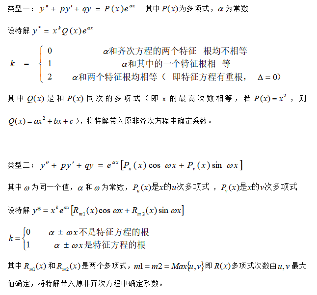
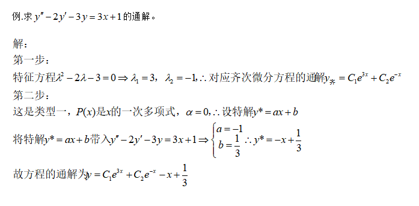

# 微积分I

## 第一章

### 1.1 集合

一些确定的对象或事物

表示方法:列举法,描述法

注:集合的集合也是一个集合

$A\subset B\quad B\subset A\Rightarrow A=B$

空集$\phi\quad\phi\subset A$

全集$\Omega$

补集$\overline{A}$

集合的运算:

$A\cup B\quad A\cap B\quad A-B \quad C_\Omega A\quad\overline{A}$

直积:

$A\times B=\{(a, b)|a\in A, b\in B\}\quad(有序对(a,b))$

区间:

开区间:(a, b),闭区间:[a, b],半开半闭:[a, b)/(a, b]

邻域:任何以a为中心,$\delta$为半径的开区间:$U(a,\delta)=\{x|a-\delta<x<a+\delta\}$

去心邻域:把中心点a去掉$U(\hat{a},\delta)=\{x|0<|x-a|<\delta\}$

### 1.2 函数

### 1.4 数列极限

定义:

$\{x_n\}若存在a,任给\epsilon>0,存在N,n>N时,|x_n-a|<\epsilon,\{x_n\}以a为极限(\{x_n\}收敛与a)\\
记作:\lim\limits_{n\rightarrow\infty}x_n=a\\$

性质1:

$\{x_n\}$收敛,极限唯一

性质2:

$\{x_n\}$收敛,数列有界

性质3:

$\lim\limits_{n\rightarrow\infty}x_n=a\quad a>0(a<0)\quad存在N\quad 使n>N时\quad x_n>0(x_n<0)$

性质4:

$\{x_n\}$收敛于a,任何子数列$\{x_{k_n}\}$收敛于a

推论1:

找到一个子数列不收敛,则原数列发散

推论2:

找到两个子数列,虽都收敛,但极限不同,原数列发散

推论3:

原数列收敛$\Leftrightarrow$奇数项,偶数项构成的子数列收敛,且极限相同

### 1.5 函数极限

### 1.6 无穷小和无穷大

### 1.7 极限的运算法则

### 1.8 两个重要极限

### 1.9 无穷小的比较

### 1.10 函数的连续

## 第二章

### 2.1 导数的定义

定义:

$连续:\Delta x\rightarrow 0,\Delta y\rightarrow 0$

$\frac{\Delta y}{\Delta x}\quad\Delta y与\Delta x趋向于0的快慢程度$

常见函数的求导公式:

$$\begin{align*}
    (c)'&=0\\
    (x^a)'&=ax^{a-1}\\
    (sin\,x)'&=cos\,x\\
    (cos\,x)'&=-sin\,x\\
    (tan\,x)'&=sec^2\,x\\
    (cot\,x)'&=-csc^2\,x\\
    (sec\,x)'&=sec\,x\:tan\,x\\
    (cscs\,x)'&=-csc\,x\:cot\,x\\
    (arcsin\,x)'&=\frac{1}{\sqrt{1-x^2}}\\
    (arccos\,x)'&=-\frac{1}{\sqrt{1-x^2}}\\
    (arctan\,x)'&=\frac{1}{1+x^2}\\
    (arccot\,x)'&=-\frac{1}{1+x^2}\\
    (a^x)'&=a^x\,\ln a\qquad (e^x)'=e^x\\
    (\log_ax)'&=\frac{a}{x\,\ln a}\qquad (\ln x)'=\frac{1}{x}
\end{align*}$$

---

可导$\Leftrightarrow$左右导数存在且相等

可导一定连续,连续不一定可导,不连续一定不可导

### 2.2 求导法则

前提:u(x),v(x)可导

$$\begin{align*}
    (u(x)\pm v(x))'&=u'(x)\pm v'(x)\\
    (\underbrace{u_1(x)\pm\cdots\pm u_n(x)}_{有限个})'&=u_1'(x)\pm\cdots\pm u_n'(x)
\end{align*}$$

$$\begin{align*}
    (uv)'&=u'v+uv'\\
    (\frac{u}{v})'&=\frac{u'v-uv'}{v^2}
\end{align*}$$

反函数求导:

$$y=f(x)\qquad x=\phi(y)\\
\phi'(y)=\frac{1}{f'(x)}$$

复合函数求导:

$$\begin{align*}
    y&=f(g(h(x)))\\
    y'&=f'(g(h(x)))\,g'(h(x))\,h'(x)
\end{align*}$$

### 2.4 高阶导数

$$y',\quad y'',\quad y''',\quad y^{(4)}\cdots$$

隐函数求导

eg.1

> $$x^2+y^2=r^2$$
>
> 两边同时对x求导
>
> $$\begin{align*}
>   2x+2yy'&=0\\
>   y'&=-\frac{x}{y}
> \end{align*}$$
>
> 高阶导数求导法则:
>
> $$\begin{align*}
>   (u\pm v)^{(n)}&=u^{(n)}\pm v^{(n)}\\
>   (cu)^{(n)}&=cu^{(n)}\\
>   (uv)^{(n)}&=\sum\limits_{i=0}^n\complement_n^iu^{(n-i)}v^{(i)}
> \end{align*}$$

注:

$y=x^n的n阶导为n!,n+1阶导为0$

### 2.5 微分

$$\Delta x\rightarrow\Delta y=y(x_0+\Delta x)-y(x_0)$$

当x发生改变时($\Delta x$):

改变量(精确值):$\Delta y=A\Delta x+0(\Delta x)$

微分值(近似值):$\mathrm{d}y=f'(x)\mathrm{d}x,$其中$\mathrm{d}x=\Delta x$

$\Rightarrow$可微

f(x)在$x_0$除可微$\Leftrightarrow$可导

微分的基本公式:

$$\begin{align*}
    \mathrm{d}(u\pm v)&=u'\mathrm{d}x+v'\mathrm{d}x=\mathrm{d}u+\mathrm{d}v\\
    \mathrm{d}(uv)&=v\mathrm{d}u+u\mathrm{d}v\\
    \mathrm{d}(cu)&=c\mathrm{d}u\\
    \mathrm{d}(\frac{u}{v})&=\frac{v\mathrm{d}u-u\mathrm{d}v}{v^2}\\
    \mathrm{d}(u(v(x)))&=u'(v(x))v'(x)\mathrm{d}x
\end{align*}$$

近似计算:

$$f(x_0+\Delta x)\approx f(x_0)+f'(x_0)\Delta x$$

## 第三章

### 3.1 中值定理

#### 3.1.1 微分中值定理

费马引理:

$f(x)在x_0,U(x_0)有意义\\
在x_0处可导,若f(x)\geq f(x_0)或f(x)\leq f(x_0)\qquad(所有x\in U(x_0))\\
则f'(x_0)=0$

$f(x)在[a,b]连续,开区间可导,在x_0处取极值,则f'(x_0)=0$

驻点: 导数为0的点

罗尔定理:

若f(x)满足:

1. 在[a,b]连续
2. 在(a,b)可导
3. f(a)=f(b)

$则至少存在\xi\in(a,b),使f'(\xi)=0$

拉格朗日中值定理:

若f(x)满足:

1. [a,b]连续
2. (a,b)可导

$则至少存在\xi\in(a,b),使f(b)-f(a)=f'(\xi)(b-a)$

定理:

$f(x)在区间I连续,I内可导且导数恒为0,则f(x)=c$

#### 3.1.2 柯西中值定理

柯西中值定理:

若f(x)和F(x)满足:

1. [a,b]连续
2. (a,b)可导
3. 所有x$\in$(a,b),F'(x)$\neq$ 0

$至少有一点\xi,使\frac{f(b)-f(a)}{F(b)-F(a)}=\frac{f'(\xi)}{F'(\xi)}$

(可以用柯西中值定理证明拉格朗日中值定理,反之不行)

#### 3.1.3 泰勒定理

正常近似: ($x-x_0$)是一次函数,不精确

$$f(x)-f(x_0)\approx f(x_0)(x-x_0)\\
f(x)\approx f(x_0)+f'(x_0)(x-x_0)$$

问题:

1. 什么条件下用n次多项式代表f(x)
2. 多项式是什么
3. 误差多大

泰勒定理:

$f(x)在含有x_0的某个开区间(a,b)上具有(n+1)阶导数,那么在开区间(a,b)上f(x)可以表示成x-x_0的n次多项式+余项R_n(x)$

带拉格朗日余项的泰勒公式:

$$f(x)=f(x_0)+f'(x_0)(x-x_0)+\frac{f''(x_0)}{2!}(x-x_0)^2+\cdots+\frac{f^{(n)}(x)}{n!}(x-x_0)^n+R_n(x)\\
R_n(x)=\frac{f^{(n+1)}(\xi)}{(n+1)!}(x-x_0)^{n+1}\qquad\xi在x及x_0之间$$

$R_n(x)\cdots拉格朗日型余项(一般忽略)$

带拉格朗日余项的马克劳林公式:

泰勒公式中的$x_0$取0

$$f(x)=f(0)+f(0)x+\frac{f''(0)}{2!}x^2+\cdots+\frac{f^{(n)}(0)}{n!}x^n+R_n(x)\\
R_n(x)=\frac{f^{(n+1)}(\xi)}{(n+1)!}x^{n+1}$$

eg.1

> $$\begin{align*}
>   e^x&\approx1+x+\frac{x^2}{2!}+\cdots+\frac{x^n}{n!}\\
>   sin\,x&\approx x-\frac{1}{3!}x^3+\frac{1}{5!}x^5+\cdots
> \end{align*}$$

### 3.2 洛必达法则

洛必达法则:

若f(x),g(x)满足:

1. $\lim\limits_{x\rightarrow x_0}f(x)=\lim\limits_{x\rightarrow x_0}g(x)=0$
2. 在$x_0$的某个x邻域内($x_0$可除外)可导,$g'(x)\neq0$
3. $\lim\limits_{x\rightarrow x_0}\frac{f'(x)}{g'(x)}=a(或\infty)$

$则\lim\limits_{x\rightarrow x_0}\frac{f(x)}{g(x)}=\lim\limits_{x\rightarrow x_0}\frac{f'(x)}{g'(x)}=a(或\infty)$

注:$\frac{\infty}{\infty}型可以进行转化:$

eg.1

> $$\lim\limits_{x\rightarrow\infty}\frac{x^4}{e^x}=\lim\limits_{x\rightarrow\infty}\frac{\frac{1}{e^x}}{\frac{1}{x^4}}\rightarrow\frac{0}{0}$$

$注:0\times\infty,\:0^0,\:1^\infty,\:\infty^0可通过e^{\ln()}来转化$

### 3.3 函数单调性与凹凸性

### 3.4 极值与最值

### 3.5 函数作图

## 第四章

### 4.1 不定积分

不定积分: 微分的逆运算或求导的逆运算

$$\int f(x)\,\mathrm{d}x=F(x)+c$$

注: 一定要加常数c

性质1:

$[\int f(x)\,\mathrm{d}x]'=f(x)$

$\int f'(x)\,\mathrm{d}x=f(x)+c\\
\int f''(x)\,\mathrm{d}x=f'(x)+c$

性质2:

$\int kf(x)\,\mathrm{d}x=k\int f(x)\,\mathrm{d}x$

1. k是常数
2. k是与x无关的另外的变量

性质3:

$\int[\underbrace{f_1(x)+f_2(x)+\cdots+f_n(x)}_{有限个}]\,\mathrm{d}x=\int f_1(x)\,\mathrm{d}x+\cdots+\int f_n(x)\,\mathrm{d}x$

### 4.2 积分法

#### 4.2.1 第一换元积分法

$$\begin{align*}
    \int g(x)\,\mathrm{d}x&=\int f(\phi(x))\,\phi'(x)\,\mathrm{d}x\\
    &=\int f(\phi(x))\,\mathrm{d}\phi(x)\\
    &=\int f(u)\,\mathrm{d}u=F(u)+c=F(\phi(x))+c
\end{align*}$$

eg.1

> $$\begin{align*}
>   &\quad\int 2x\,cos\,x^2\,\mathrm{d}x\\
>   =&\int cos\,x^2\,\mathrm{d}x^2\\
>   =&sin\,x^2+c
>   \end{align*}$$

eg.2

> $$\begin{align*}
>   &\int\frac{1+x^2}{1+x^4}\,\mathrm{d}x\\
>   =&\int\frac{\frac{1}{x^2}+1}{\frac{1}{x^2}+x^2}\,\mathrm{d}x\\
>   =&\int\frac{1}{(x-\frac{1}{x})^2+2}\,\mathrm{d}(x-\frac{1}{x})\\
>   =&\int\frac{1}{\sqrt{2}^2}\frac{1}{(\frac{x-\frac{1}{x}}{\sqrt{2}})^2+1}\,\mathrm{d}(x-\frac{1}{x})\\
>   =&\frac{1}{\sqrt{2}}\int\frac{1}{(\frac{x-\frac{1}{x}}{\sqrt{2}})^2+1}\,\mathrm{d}(\frac{x-\frac{1}{x}}{\sqrt{2}})\\
>   =&\frac{arctan(\frac{x-\frac{1}{x}}{\sqrt{2}})}{\sqrt{2}}+c
>   \end{align*}$$

#### 4.2.2 第二换元积分法

$$x=\phi(t)\\
\int f(x)\,\mathrm{d}x=\int f(\phi(t))\,\phi'(t)\,\mathrm{d}t$$
(多用于消根号)

eg.1

> $$\begin{align*}
>   a&=\int\frac{\mathrm{d}x}{\sqrt{2x-3}}\\
>   令t=&\sqrt{2x-3},\:x=\frac{1}{2}t^2+\frac{3}{2}\\
>   \mathrm{d}x&=t\,\mathrm{d}t\\
>   a&=\int\frac{t\,\mathrm{d}t}{(\frac{1}{2}t^2+\frac{3}{2})t}\\
>   &=2\int\frac{\mathrm{d}t}{t^2+3}\\
>   &=\frac{2}{3}\sqrt{3}arctan\frac{t}{\sqrt{3}}+c\\
>   &=\frac{2}{3}\sqrt{3}arctan\frac{\sqrt{6x-9}}{3}+c
> \end{align*}$$

#### 4.2.3 分部积分法

$$\int u\,\mathrm{d}v=uv-\int v\,\mathrm{d}u$$

推导:

$$\begin{align*}
    (uv)'&=u'v+uv'\\
    uv'&=(uv)'-u'v\\
    \int uv'\,\mathrm{d}x&=\int(uv)'\,\mathrm{d}x-\int u'v\,\mathrm{d}x\\
    \int u\,\mathrm{d}v&=uv-\int v\,\mathrm{d}u
\end{align*}$$

(1)谁放d后面

> $$\int x\,sin\,x\,\mathrm{d}x=-\int x\,\mathrm{d}cos\,x\\
> =-(x\,cos\,x-\int cos\,x\,\mathrm{d}x)=-x\,cos\,x+sin\,x+c$$

(2)能积出来,能让积分更简单

> $$\int xe^x\,\mathrm{d}x=\int x\,\mathrm{d}e^x=xe^x-\int e^x\,\mathrm{d}x=xe^x-e^x+c$$

(3)优先:

$$e^x>sin\,x,\:cos\,x>x,\:x^n>\ln x,\:arctan\,x$$

### 4.3 有理函数的积分

真分式:分子最高次低于分母最高次的分式

(如果分子最高次小于等于分母最高次的分式,进行除法列竖式)

eg.1(分子0次,分母2次)

> $$e=\int\frac{1}{ax^2+bx+c}\,\mathrm{d}x$$
>
> ---
>
> $\quad b^2-4ac=0$
>
> $\quad a(x-x_1)^2=0$
>
> $$e=\int\frac{1}{a(x-x_1)^2}\,\mathrm{d}(x-x_1)=-\frac{1}{a}\frac{1}{x-x_1}+c$$
>
> ---
>
> 
>
> $\quad b^2-4ac>0$
>
> $\quad a(x-x_1)(x-x_2)=0$
>
> $$\begin{align*}
>   e&=\int\frac{1}{a(x-x_1)(x-x_2)}\,\mathrm{d}x\\
>   &=\frac{1}{a}\int(\frac{A}{x-x_1}+\frac{B}{x-x_2})\,\mathrm{d}x
> \end{align*}$$
>
> $\quad -x_2A-x_1B=1$
>
> $\quad Ax+Bx=0$
>
> 解得:
>
> $\quad A=\frac{1}{x_1-x_2}$
>
> $\quad B=\frac{1}{x_2-x_1}$
>
> $$\begin{align*}
>   e&=\frac{1}{a}\Bigg(\frac{1}{x_1-x_2}\int\frac{1}{x-x_1}\,\mathrm{d}(x-x_1)+\frac{1}{x_2-x_1} \int\frac{1}{x-x_2}\,\mathrm{d}(x-x_2)\Bigg)\\
>   &=\frac{1}{a}\Bigg(\frac{1}{x_1-x_2}\ln|x-x_1|+\frac{1}{x_2-x_1}\ln|x-x_2|\Bigg)
> \end{align*}$$
>
> ---
>
> 
>
> $\quad b^2-4ac<0$
>
> $\quad a\Big((x+x_1)^2+n\Big)=0$
>
> $$e=\frac{1}{a}\int\frac{1}{(x+x_1)^2+n}\,\mathrm{d}(x+x_1)$$
> 接着...如[4.2.1.eg.2](#4.2.1.eg.2)

eg.2(分子1次,分母2次)

> $$\begin{align*}
>   e&=\int\frac{mx+n}{ax^2+bx+c}\,\mathrm{d}x\\
>   &=\frac{m}{a}\int\frac{x+\frac{n}{m}}{x^2+\frac{b}{a}x+\frac{c}{a}}\,\mathrm{d}x
> \end{align*}$$
>
> ---
>
> $b^2-4ac=0$
>
> $$\begin{align*}
>   e&=\frac{m}{a}\int\frac{x+\frac{n}{m}}{(x-x_1)^2}\,\mathrm{d}x\\
>   &=\frac{m}{a}\int\frac{x-x_1+\frac{n}{m}+x_1}{(x-x_1)^2}\,\mathrm{d}x\\
>   &=\frac{m}{a}\Bigg(\int\frac{1}{x-x_1}\,\mathrm{d}(x-x_1)+\int\frac{\frac{n}{m}+x_1}{(x-x_1)^2}\,\mathrm{d}(x-x_1)\Bigg)\\
>   &=\frac{m}{a}\ln|x-x_1|-\frac{n+mx_1}{a(x-x_1)}+c
>   \end{align*}$$
>
> ---
>
> $b^2-4ac>0$
>
> $$\begin{align*}
>   e&=\frac{m}{a}\int\frac{x+\frac{n}{m}}{(x-x_1)(x-x_2)}\,\mathrm{d}x\\
>   &=\frac{m}{a}\int\Big(\frac{A}{x-x_1}+\frac{B}{x-x_2}\Big)\,\mathrm{d}x
> \end{align*}$$
>
> $$
>   \left\{
>   \begin{align*}
>       -x_2A-x_1B&=\frac{n}{m}\\
>       Ax+Bx&=x
>   \end{align*}\right.$$
>
>解得:
>
>$$\left\{
> \begin{align*}
>   A=\frac{\frac{n}{m}+x_1}{x_1-x_2}\\
>   B=\frac{\frac{n}{m}+x_2}{x_2-x_1}
> \end{align*}\right.$$
>
> 接着...如[4.3.eg.1.2](#4.3.eg.1.2)
>
> ---
>
> $b^2-4ac<0$
>
> $$\begin{align*}
>e&=\frac{m}{a}\int\frac{x+\frac{n}{m}}{(x-x_1)^2+i}\,\mathrm{d}x\\
> &=\frac{m}{a}\Bigg(\int\frac{x-x_1}{x^2+2x_1x+x_1^2+i}\,\mathrm{d}x+(\frac{n}{m}+x_1)\int\frac{1}{x^2+2x_1x+x_1^2+i}\,\mathrm{d}x\Bigg)\\
>   &=\frac{m}{a}\Bigg(\frac{1}{2}\int\frac{\mathrm{d}(x^2+2x_1x+x_1^2+i)}{x^2+2x_1x+x_1^2+i}+(\frac{n}{m}+x_1)\int\frac{1}{x^2+2x_1x+x_1^2+i}\,\mathrm{d}x\Bigg)\\
>   &=\frac{m}{2a}\ln|x^2+2x_1x+x_1^2+i|+\frac{n+mx_1}{a}\int\frac{1}{x^2+2x_1x+x_1^2+i}\,\mathrm{d}x
>   \end{align*}$$

接着右...如[4.3.eg.1.3](#4.3.eg.1.3)

通解:(分子最高次数比分母小)

$$设\int\frac{Q(x)}{P(x)}\,\mathrm{d}x$$

$$则Q(x)=\\
n(x-a_0)^{\alpha_0}(x-a_0)^{\alpha_0-1}\cdots(x-a_0)\\
\times(x-a_1)^{\alpha_1}(x-a_1)^{\alpha_1-1}\cdots(x-a_1)\\
\vdots\\
\times(x^2+b_0x+c_0)^{\beta_0}(x^2+b_0x+c_0)^{\beta_0-1}\cdots(x^2+b_0x+c_0)\\
\times(x^2+b_1x+c_1)^{\beta_1}(x^2+b_1x+c_1)^{\beta_1-1}\cdots(x^2+b_1x+c_1)\\
\vdots$$

接着...如[4.3.eg.1.2](#4.3.eg.1.2)使用待定系数法解方程再拆开积

eg.3.1

> $$\begin{align*}
>   e&=\int\frac{x^2+1}{(x+2)(x+1)^2}\,\mathrm{d}x\\
>   &=\int\Big(\frac{A_1}{x+2}+\frac{A_2}{(x+1)^2}+\frac{A_3}{x+1}\Big)\,\mathrm{d}x\\
>   &=\int\frac{A_1(x+1)^2+A_2(x+2)+A_3(x+2)(x+1)}{(x+2)(x+1)^2}
> \end{align*}$$
>
> 得到$A_1(x^2+2x+1)+A_2(x+2)+A_3(x^2+3x+2)$
>
> 解方程:
>
> $$\left\{
>   \begin{align*}
>      1\times x^2&=A_1\,x^2+A_3\,x^2\\
>       0\times x&=2A_1^2\,x+A_2\,x+3A_3\,x\\
>       1&=A_1+2A_2+2A_3
>    \end{align*}\right.$$
>
> 得到
>
>$$\left\{
>\begin{align*}
>    A_1&=5\\
>      A_2&=2\\
>      A_3&=-4
>    \end{align*}\right.$$
>
> $$e=\int\Big(\frac{5}{x+2}+\frac{2}{(x+1)^2}-\frac{1}{x+1}\Big)\,\mathrm{d}x$$
>
>然后拆开积,完成

## 第五章

### 5.1 定积分的概念

定积分的定义: 曲边梯形面积

$$a=x_0<x_1<x_2\quad\cdots\quad<x_n=b$$

$$得到\Delta x_1, \Delta x_2\quad\cdots\quad\Delta x_n$$

$$A=\Delta x_1f(\xi_1) + \Delta x_2f(\xi_2)+\quad\cdots\quad+\Delta x_1f(\xi_n)$$

$$\lambda=\max(\Delta x_1\quad\cdots\quad\Delta x_n)$$

$$A=\lim\limits_{\lambda\rightarrow0}\sum\limits_{i=1}^nf(\xi_i)\Delta x_i$$

注意:定积分与被积函数和积分区间有关,与积分变量无关

定理1:连续$\Rightarrow$可积

定理2:有界且有有限个断点$\Rightarrow$可积

补充:

$$\lim\limits_{n\rightarrow\infty}\sum\limits_{i=1}^nf(\frac{i}{n})=\int_0^1f(x)\,\mathrm{d}x$$

### 5.2 定积分的性质,微积分基本定理

性质1:

$$\int_a^b\Big(\alpha f(x)+\beta g(x)\Big)\,\mathrm{d}x=\alpha\int_a^bf(x)\,\mathrm{d}x+\beta\int_a^bg(x)\,\mathrm{d}x$$

性质2:

$$a<b<c\\
\int_a^bf(x)\,\mathrm{d}x=\int_a^cf(x)\,\mathrm{d}x+\int_c^bf(x)\,\mathrm{d}x$$

性质3:

$$\begin{align*}
    f(x)&\equiv1\\
    \int_a^b1\,\mathrm{d}x&=b-a\\
    \Rightarrow\int_a^bk\,\mathrm{d}x&=k(b-a)
\end{align*}$$

性质4:

$$\begin{align*}
    f(x)&\geq0\\
    \int_a^bf(x)\,\mathrm{d}x&\geq0
\end{align*}$$

推导1:

$$\begin{align*}
    f(x)&\leq g(x)\\
\int_a^bf(x)\,\mathrm{d}x&\leq\int_a^bf(x)\,\mathrm{d}x
\end{align*}$$

推导2:

$$|\int_a^bf(x)\,\mathrm{d}x|\leq\int_a^bf(x)\,\mathrm{d}x$$

性质5:

$$f(x)_{max}=M;f(x)_{min}=m;\quad x\in[a, b]\\
m(b-a)\leq\int_a^bf(x)\,\mathrm{d}x\leq M(b-a)$$

性质6:

$$f(x)连续,存在\xi\in[a, b]\\
使\int_a^bf(x)\,\mathrm{d}x=f(\xi)(b-a)$$

定理1:

$$p(x)=\int_a^xf(t)\,\mathrm{d}t;\quad x\in[a,b]\\
p'(x)=f(x)$$

上限是x,直接将x带入被积函数

定理2:

下限是x,直接将x带入被积函数,前面加负号

定理3:

上限是g(x),先将g(x)带入原函数,再乘g'(x)

定理4:

下限是g(x),先将g(x)带入原函数,再乘-g'(x)

定理5:

$$\begin{align*}
    [\int_{h(x)}^{g(x)}f(x)\,\mathrm{d}x]'&=\int_{h(x)}^cf(x)\,\mathrm{d}x+\int_c^{g(x)}f(x)\,\mathrm{d}x\\
    &=f(g(x))g'(x)-f(h(x))h'(x)
\end{align*}$$

牛-莱公式:

$$\int_a^bf(x)\,\mathrm{d}x=F(x)|_a^b=F(a)-F(b)$$

### 5.3 定积分的换元和分部积分法

换元积分法:

$x=\phi(t)$

$\phi(t)$单调(增,减)

上下限也变原变量上(下)限对应新变量上(下)限

$$\int_a^bf(x)\,\mathrm{d}x=\int_\alpha^\beta f(\phi(t))\,\phi'(t)\,\mathrm{d}t$$

奇偶定积分:

$$\begin{align*}
    f(x)偶\Rightarrow&\int_{-a}^af(x)\,\mathrm{d}x=2\int_0^af(x)\,\mathrm{d}x\\
    f(x)奇\Rightarrow&\int_{-a}^af(x)\,\mathrm{d}x=0
\end{align*}$$

分部积分法:

$$\int_a^bu\,\mathrm{d}v=uv|_a^b-\int_a^bv\,\mathrm{d}u$$

### 5.4 定积分应用-求面(体)积

### 5.5 广义积分

#### 5.5.1 无穷限积分

$$\begin{align*}
    \int_a^{+\infty}f(x)\,\mathrm{d}x&=\lim\limits_{b\rightarrow\infty}\int_a^bf(x)\,\mathrm{d}x\\
    \int_{-\infty}^bf(x)\,\mathrm{d}x&=\lim\limits_{a\rightarrow-\infty}\int_a^bf(x)\,\mathrm{d}x\\
    \int_{-\infty}^{+\infty}f(x)\,\mathrm{d}x&=\int_{-\infty}^cf(x)\,\mathrm{d}x+\int_c^{+\infty}f(x)\,\mathrm{d}x=\cdots
\end{align*}$$

> $$\begin{align*}
>   &\int_1^{+\infty}\frac{1}{x^p}\,\mathrm{d}x\\
>   =&\frac{1}{p-1}\cdots p>1\\
>   =&发散\cdots p\leq1
> \end{align*}$$

性质1:

$$\int_a^{+\infty}f(x)\,\mathrm{d}x收敛\Rightarrow\int_a^{+\infty}kf(x)\,\mathrm{d}x收敛$$

性质2:

$$\int_a^{+\infty}f(x)\,\mathrm{d}x与\int_a^{+\infty}g(x)\,\mathrm{d}x都收敛\\
\Rightarrow\int_a^{+\infty}\Big(f(x)\pm g(x)\Big)\,\mathrm{d}x收敛$$

反之不一定成立

收敛判定:

定理1:

$$f(x)\geq0\\
\int_a^{+\infty}f(x)\,\mathrm{d}x收敛\Leftrightarrow p(x)=\int_a^{x}f(t)\,\mathrm{d}t有界$$

定理2:

$$0\leq f(x)\leq g(x)\\
\int_a^{+\infty}g(x)\,\mathrm{d}x收敛\Rightarrow\int_a^{+\infty}f(x)\,\mathrm{d}x收敛\\
\int_a^{+\infty}f(x)\,\mathrm{d}x发散\Rightarrow\int_a^{+\infty}g(x)\,\mathrm{d}x发散$$

定义(绝对/条件收敛):

$$\int_a^{+\infty}f(x)\,\mathrm{d}x收敛;\int_a^{+\infty}|f(x)|\,\mathrm{d}x收敛\Rightarrow\int_a^{+\infty}f(x)\,\mathrm{d}x绝对收敛\\
\int_a^{+\infty}f(x)\,\mathrm{d}x收敛;\int_a^{+\infty}|f(x)|\,\mathrm{d}x发散\Rightarrow\int_a^{+\infty}f(x)\,\mathrm{d}x条件收敛$$

定理3:

绝对收敛必收敛

$$\int_a^{+\infty}|f(x)|\,\mathrm{d}x收敛\Rightarrow\int_a^{+\infty}f(x)\,\mathrm{d}x收敛$$

#### 5.5.2 瑕积分

定义:无界函数的广义积分

若函数f(x)在点a的任意一邻域内都无界,那么点a称为函数f(x)的**瑕点**(也称无穷间断点)

$$\begin{align*}
    \int_a^bf(x)\,\mathrm{d}x&=\lim\limits_{\epsilon^+\rightarrow0}\int_a^{b-\epsilon^+}f(x)\,\mathrm{d}x\\
    \int_a^bf(x)\,\mathrm{d}x&=\lim\limits_{\epsilon^+\rightarrow0}\int_{a+\epsilon^+}^bf(x)\,\mathrm{d}x\\
    \int_a^bf(x)\,\mathrm{d}x&=\int_a^cf(x)\,\mathrm{d}x+\int_c^bf(x)\,\mathrm{d}x=\cdots
\end{align*}$$

$$\begin{align*}
    &\int_0^1\frac{1}{x^p}\,\mathrm{d}x\\
    =&\frac{1}{1-p}\cdots p>1\\
    =&发散\cdots p\leq1
\end{align*}$$

注:瑕点不能通过换元掩饰掉,可以转移位置

步骤:

1. 判断是否为瑕积分

2. 找到瑕点

3. 按区间计算

#### 5.5.3伽马函数

$$\Gamma(r)=\int_0^{+\infty}x^{r-1}x^{-x}\,\mathrm{d}x\qquad(r>0)$$

性质:

$$\Gamma(r+1)=r\Gamma(r)\\
\Gamma(n+1)=n!\qquad(n\in N^+)$$

## 第六章

### 6.1 空间解析几何

### 6.2 多元函数的基本概念

### 6.3 偏导数

### 6.4 全微分

### 6.5 多元复合函数求导和隐函数求导

### 6.6 二元函数的极值

### 6.7 二重积分的定义和性质

概念:体积(曲顶柱体)

$$d_i为小区域面积\qquad d=\max\{d_i\}\\
\lim\limits_{d\rightarrow0}\sum\limits_{i=1}^nf(x_i,y_i)\Delta\delta i=\iint\limits_D f(x,y)\,\mathrm{d}\sigma=\iint\limits_D f(x,y)\,\mathrm{d}x\mathrm{d}y$$

$D\cdots定义域$

性质1:

$\iint\limits_D kf(x,y)\,\mathrm{d}\sigma=k\iint\limits_D f(x,y)\,\mathrm{d}\sigma$

性质2:

$\iint\limits_D [f(x,y)\pm g(x,y)]\,\mathrm{d}\sigma=\iint\limits_D f(x,y)\,\mathrm{d}\sigma\pm\iint\limits_D g(x,y)\,\mathrm{d}\sigma$

性质3:

$D=D_1+D_2$

$\iint\limits_D f(x,y)\,\mathrm{d}\sigma=\iint\limits_{D_1} f(x,y)\,\mathrm{d}\sigma+\iint\limits_{D_2} f(x,y)\,\mathrm{d}\sigma$

性质4:

$f(x,y)\leq g(x,y)\Rightarrow\iint\limits_D f(x,y)\,\mathrm{d}\sigma\leq\iint\limits_D g(x,y)\,\mathrm{d}\sigma$

推论:

$|\iint\limits_D f(x,y)\,\mathrm{d}\sigma|\leq\iint\limits_D |f(x,y)|\,\mathrm{d}\sigma$

性质5:

$f(x,y)\equiv1$

$\iint\limits_D 1\,\mathrm{d}\sigma=\sigma$

性质6:

$m,M为f(x,y)在D内的最小值和最大值$

性质7:

二元函数中值定理

$在D内一定可以找到一点,使得f(\xi,n)\sigma=\iint\limits_Df(x,y)\,\mathrm{d}\sigma$

$m\sigma\leq\iint\limits_D f(x,y)\,\mathrm{d}\sigma\leq M\sigma$

### 6.8 二重积分的计算(直角/极坐标系)

#### 直角坐标系

$$X型:\iint\limits_Df(x,y)\,\mathrm{d}x\mathrm{d}y=\int_a^b\,\mathrm{d}x\int_{\phi_1(x)}^{\phi_2(x)}f(x,y)\,\mathrm{d}y\\
Y型:\iint\limits_Df(x,y)\,\mathrm{d}x\mathrm{d}y=\int_c^d\,\mathrm{d}y\int_{\phi_1(y)}^{\phi_2(y)}f(x,y)\,\mathrm{d}x$$

eg.1

> $$\begin{align*}
>   &\iint\limits_Dxy\,\mathrm{d}x\mathrm{d}y\\
>   X型:\:=&\int_0^1\mathrm{d}x\int_x^1xy\,\mathrm{d}y\\
>   =&\int_0^1\frac{1}{2}xy^2|_x^1\,\mathrm{d}x\\
>   =&\int_0^1\frac{1}{2}x-\frac{1}{2}x^3\,\mathrm{d}x=\frac{1}{8}\\
>   Y型:\:=&\int_0^1\mathrm{d}y\int_0^yxy\,\mathrm{d}x
> \end{align*}$$

特殊1:

$D为矩形,x\in[a,b],y\in[c,d]$

$$\int_a^b\mathrm{d}x\int_c^df(x,y)\,\mathrm{d}y=\int_c^d\mathrm{d}y\int_a^bf(x,y)\,\mathrm{d}x$$

特殊2:

$D为矩形,x\in[a,b],y\in[c,d],f(x,y)=f_1(x)f_2(y)$

$$\int_a^b\mathrm{d}x\int_c^df(x,y)\,\mathrm{d}y=\int_a^bf_1(x)\,\mathrm{d}x\int_c^df_2(y)\,\mathrm{d}y$$

#### 极坐标系

## 第七章

### 7.1 无穷级数的定义和性质

$无穷级数:S=\overbrace{u_1+u_2+\cdots+\underbrace{u_n}_{通项}+\cdots}^{无穷项}$

$部分和:S_n=u_1+u_2+\cdots+u_n$

$S_1=u_1\quad S_2=u_1+u_2\quad S_3=u_1+u_2+u_3$

$\lim\limits_{n\rightarrow\infty}S_n=S$

$余项R_n=S-S_n=u_{n+1}+\cdots$

几何级数:

$S=a+aq+aq^2+aq^3+\cdots(a\neq0)$

首项: a

公比: q

$S_n=a+aq+\cdots+aq^{n-1}=\frac{a(1-q^n)}{1-q}$

当$n\rightarrow\infty$时

- $|q|<1,收敛\quad\lim\limits_{n\rightarrow\infty}S_n=\frac{a}{1-q}$
- $|q|>1,发散$
- $|q|=1$
  - $q=1\quad S_n=a+a+a+\cdots\qquad发散$
  - $q=-1\quad S_n=a-a+a-a+a-a+\cdots\qquad发散$

调和级数:

$S=1+\frac{1}{2}+\frac{1}{3}+\cdots+\frac{1}{n}+\cdots\qquad发散$

无穷级数的性质:

性质1:

$u_1+u_2+\cdots+u_n+\cdots=S\cdots收敛$

$au_1+au_2+\cdots+au_n+\cdots=aS\cdots收敛$

性质2:

$\sum u_n\quad\sum v_n都收敛\cdots\sum(u_n\pm v_n)也收敛,反之不一定成立$

性质3:

$收敛级数,任意加小括号仍收敛$

性质4:

$级数去掉,加上,改变有限项,敛散性不变$

性质5:

$级数收敛的必要条件:\lim\limits_{n\rightarrow\infty}u_n=0$

性质6:

$\sum a_n收敛\quad\sum b_n发散\Rightarrow\sum(a_n+b_n)发散$

$\sum a_n发散\quad\sum b_n发散\Rightarrow\sum(a_n+b_n)可能不发散$

### 7.2 正项级数

$$u_n\geq0$$

定理1:

$\sum u_n为正项级数且收敛\Leftrightarrow\{S_n\}有界$

定理2:

比较判别法:

$正项级数\sum u_n\quad\sum v_n\\
u_n\leq v_n\\$

- $\sum u_n收敛\Rightarrow\sum v_n收敛$
- $\sum v_n发散\Rightarrow\sum u_n发散$

p级数:

$\sum\frac{1}{n^p}\quad(n:1\rightarrow\infty)$

$p\leq1\cdots发散\\
p>1\cdots收敛$

实际做题中，在用比较判别法时，通常用几何级数，调和级数，p级数当参照物

比较判别法推论:

$正项级数\sum u_n\quad\sum v_n\\
\lim\limits_{n\rightarrow\infty}\frac{u_n}{v_n}=l$

- $0<l<+\infty\cdots\sum u_n\ \sum v_n有相同敛散性$
- $l=0\cdots\sum u_n\ \sum v_n都收敛$
- $l=+\infty\cdots\sum u_n\ \sum v_n都发散$

比值判别法:

$正项级数\sum u_n\\
\lim\limits_{n\rightarrow\infty}\frac{u_{n+1}}{u_n}=l$

- $l<1\cdots收敛$
- $l>1\cdots发散$
- $l=1\cdots无法判断$

根值判别法(柯西判别法):

$正项级数\sum u_n\\
\lim\limits_{n\rightarrow\infty}\sqrt[n]{u_n}=\rho$

- $\rho<1\cdots收敛$
- $\rho>1\cdots发散$
- $\rho=1\cdots无法判断$

判断正项级数$u_n$:

$\lim\limits_{n\rightarrow\infty}u_n$

- $\neq0\cdots发散$
- $=0$
  - 根值判别法
  - 比值判别法
  - 比较判别法推论
  - 比较判别法
    - 几何级数
    - 调和级数
    - p级数

### 7.3 任意项级数

交错级数:

$\sum(-1)^nu_n\qquad(n:1\rightarrow\infty)$

莱布尼兹定理1:

判断交错级数是否收敛

交错级数,满足:

1. $u_n\geq u_n+1$
2. $\lim\limits_{n\rightarrow\infty}u_n=0$

则交错级数收敛

证明上定理条件1:

1. $u_n-u_{n+1}\geq0$
2. $\frac{u_n}{u_{n+1}}\geq1$
3. $u_n=f(n)\rightarrow f(x)可导\\f'(x)\leq0\qquad(x较大时)$

任意项级数敛散性判定:

$u_1+u_2+u_3+\cdots\rightarrow\underbrace{|u_1|+|u_2|+|u_3|+\cdots}_{绝对值级数}$

定理2:

$\sum|u_n|收敛\Rightarrow\sum u_n收敛\\
\sum u_n发散\Rightarrow\sum |u_n|发散$

(加绝对值增加发散性，去绝对值增加收敛性)

---

$\sum|u_n|收敛\cdots\sum|u_n|绝对收敛\\
\sum|u_n|发散\quad\sum u_n收敛\cdots条件收敛$

定理3:

$对任意项级数:u_1+u_2+\cdots+u_n+\cdots\qquad\lim\limits_{n\rightarrow\infty}|\frac{u_{n+1}}{u_n}|=l$

- $l<1\cdots\sum u_n绝对收敛$
- $l>1\cdots\sum u_n发散$
- $l=1\cdots无法判断$

总结:

- 收敛:
  - 绝对收敛: $\sum|u_n|收敛(正项级数)\quad\sum u_n收敛$
  - 条件收敛(多见于交错级数): $\sum|u_n|发散(正项级数)\quad\sum u_n收敛(莱布尼兹定理)$
- 发散:
  - $\sum u_n发散(通项不\rightarrow0/定义)\rightarrow\sum|u_n|发散$

性质1:

$\sum u_n绝对收敛\Rightarrow任意交换顺序,\sum u_n还是收敛且和不变$

性质2:

$\sum u_n\quad\sum v都绝对收敛\Rightarrow\sum u_iv_i也绝对收敛$

### 7.4 幂级数

$S(x)=a_0+a_1x+a_2x^2+\cdots+a_nx^n+\cdots$

$S(x)=u_0(x)+u_2(x)+\cdots+u_n(x)+\cdots$

$x=x_0\qquad\sum u_n(x_0)有极限\rightarrow收敛,否则发散$

$x\in D\qquad\sum u_n(x)收敛\rightarrow D:收敛域$

$S(x)=\lim\limits_{n\rightarrow\infty}S_n(x)$

$R_n(x)=S(x)-S_n(x)\\若级数收敛,则余项\rightarrow0$

判断幂级数是否收敛:

$$\lim\limits_{n\rightarrow\infty}|\frac{u_{n+1}}{u_n}|=\lim\limits_{n\rightarrow\infty}|\frac{a_{n+1}x^{n+1}}{a_nx^n}|=|x|\lim\limits_{n\rightarrow\infty}|\frac{a_{n+1}}{a_n}|=l|x|$$

- $l|x|<1或|x|<\frac{1}{l}\cdots绝对收敛$
- $l|x|>1或|x|>\frac{1}{l}\cdots发散$
- $l|x|=1或x\pm\frac{1}{l}\cdots无法判断$
- $l=0\cdots收敛$
- $l=\infty\cdots只有当x=0时,级数收敛$

定理:

$如果幂级数:a_0+a_1x+a_2x^2+\cdots+a_nx^n+\cdots$

$\lim\limits_{n\rightarrow\infty}|\frac{a_{n+1}}{a_n}|=l$

- $0<l<\infty\cdots收敛半径R=\frac{1}{l}(|x|=\frac{1}{l}时,端点单独讨论)$
- $l=0\cdots R=\infty$
- $l=\infty\cdots R=0$

性质1:

$\sum a_nx^n\quad\sum b_nx^n\quad收敛半径为R_1,R_2\quad和函数分别为S_1(x),S_2(x)$

$\sum(a_n\pm b_n)x^n=S_1(x)\pm S_2(x)\qquad收敛域|x|<\min\{R_1,R_2\}$

性质2:

$如果收敛半径R>0,那么在区域-R到R内级数的和函数是连续的,并且在R或-R的两端点也收敛的话,那么在这两个端点上,级数是左连续或者右连续的$

性质3:

$S_n(x)=\sum\limits_{n=1}^\infty a_nx^n$

$S_n'(x)=\sum\limits_{n=1}^\infty (a_nx^n)'=\sum a_nnx^{n-1}\qquad收敛半径相同$

性质4:

$S_n(x)=\sum\limits_{n=1}^\infty a_nx^n$

$\int_0^xS_n(x)\,\mathrm{d}x=\sum\limits_{n=1}^\infty\int_0^xa_nx^n\,\mathrm{d}x=\sum\limits_{n=1}^\infty a_n\frac{x^{n+1}}{n+1}\qquad收敛半径相同\\
端点处是否收敛需重新判断$

## 第八章

### 8.1 微分方程的概念

eg.1

> 曲线过(1,3),切线斜率:2x,求方程
>
> $$\begin{align*}
>   y&=x^2+c\\
>   3&=1+c\\
>   c&=2\\
>   y&=x^2+2\\
>   y&=2x
> \end{align*}$$

微分方程: 一般的，凡事表示未知函数、未知函数的导数和自变量之间的关系的方程

微分方程的阶: 微分方程中所出现的未知函数的最高阶导数的阶数也叫作

一元函数: 常微分方程

多元函数: 偏微分方程

通解: 微分方程的解中含有任意常数，且任意常数的个数与微分方程的阶数相同，这样的解叫作微分方程的通解

特解: 通解确定了通解中任意常数的值之后，便叫作微分方程的特解

### 8.2 一阶微分方程

方法1:分离变量

转化为:

$$\begin{align*}
    M(x)\,\mathrm{d}x&=N(y)\,\mathrm{d}y\\
    \int M(x)\,\mathrm{d}x&=\int N(y)\,\mathrm{d}y+c
\end{align*}$$

eg.1

> $$\begin{align*}
>   \frac{\mathrm{d}y}{\mathrm{d}x}&=2xy\\
>   \frac{1}{y}\,\mathrm{d}y&=2x\,\mathrm{d}x\\
>   \int\frac{1}{y}\,\mathrm{d}y&=\int2x\,\mathrm{d}x+c\\
>   \ln|y|&=x^2+c\\
>   |y|&=e^ce^{x^2}\\
>   y&=ce^{x^2}
> \end{align*}$$

微分方程可不加绝对值,其他要加

---

方法2:齐次

$$\frac{\mathrm{d}y}{\mathrm{d}x}=f(\frac{y}{x})$$

eg.2

> $$\frac{\mathrm{d}y}{\mathrm{d}x}=2\sqrt{\frac{y}{x}}+\frac{y}{x}\\
> 令u=\frac{y}{x},\quad y=xu\Rightarrow \frac{\mathrm{d}y}{\mathrm{d}x}=u+x\frac{\mathrm{d}u}{\mathrm{d}x}(将此式与上式联立)$$
>
> ---
>
> 解法:
>
> $$\begin{align*}
>   u+x\frac{\mathrm{d}u}{\mathrm{d}x}&=f(u)\\
>   \frac{\mathrm{d}u}{f(u)-u}&=\frac{\mathrm{d}x}{x}\\
>   \int\frac{\mathrm{d}u}{f(u)-u}&=\int\frac{\mathrm{d}x}{x}+c
> \end{align*}$$
>
> ---
>
> 此题解法:
>
> $$\begin{align*}
>   \cancel{u}+x\frac{\mathrm{d}u}{\mathrm{d}x}&=2\sqrt{u}+\cancel{u}\\
>   \frac{\mathrm{d}u}{2\sqrt{u}}&=\frac{\mathrm{d}x}{x}\\
>   \int\frac{\mathrm{d}u}{2\sqrt{u}}&=\int\frac{\mathrm{d}x}{x}+c\\
>   \sqrt{u}&=\ln x+c\\
>   \frac{y}{x}&=(\ln x+c)^2\\
>   y&=x(\ln x+c)^2
> \end{align*}$$

---

方法3:一阶线性

 一阶线性齐次微分方程:

$$\begin{align*}
    y'+p(x)y&=0\\
    \frac{\mathrm{d}y}{\mathrm{d}x}&=-p(x)y\\
    \frac{\mathrm{d}y}{y}&=-p(x)\,\mathrm{d}x\\
    \int\frac{\mathrm{d}y}{y}&=\int-p(x)\,\mathrm{d}x\\
    \ln y&=-\int p(x)\,\mathrm{d}x+c\\
    y&=e^{-\int p(x)\,\mathrm{d}x}e^c\\
    y&=ce^{-\int p(x)\,\mathrm{d}x}\\
\end{align*}$$

一阶线性非齐次微分方程:

$$\begin{align}
    y'+p(x)y&=q(x)\\
    \frac{1}{y}\frac{\mathrm{d}y}{\mathrm{d}x}+p(x)&=\frac{q(x)}{y}\\
    \frac{1}{y}\,\mathrm{d}y&=\frac{q(x)}{y}\,\mathrm{d}x-p(x)\,\mathrm{d}x\\
    \int\frac{1}{y}\,\mathrm{d}y&=\int\frac{q(x)}{y}\,\mathrm{d}x-\int p(x)\,\mathrm{d}x+c\\
    \ln y&=\int\frac{q(x)}{y}\,\mathrm{d}x-\int p(x)\,\mathrm{d}x+c\\
    y&=\underbrace{e^ce^{\int\frac{q(x)}{y}\,\mathrm{d}x}}_{设其为c(x)}e^{-\int p(x)\,\mathrm{d}x}\\
    y&=c(x)e^{-\int p(x)\,\mathrm{d}x}\\
    y'&=c'(x)e^{-\int p(x)\,\mathrm{d}x}-c(x)e^{-\int p(x)\,\mathrm{d}x}p(x)\\
\end{align}$$

联立(8)(1)(7)得到:

$$\begin{align}
    c'(x)e^{-\int p(x)\,\mathrm{d}x}\cancel{-c(x)p(x)e^{-\int p(x)\,\mathrm{d}x}}&\cancel{+c(x)p(x)e^{-\int p(x)\,\mathrm{d}x}}=q(x)\\
    c'(x)&=q(x)e^{\int p(x)\,\mathrm{d}x}\\
    c(x)&=\int q(x)e^{\int p(x)\,\mathrm{d}x}\,\mathrm{d}x+c
\end{align}$$

联立(11)(7)得到:

$$y=e^{-\int p(x)\,\mathrm{d}x}\Big(\int q(x)e^{\int p(x)\,\mathrm{d}x}\,\mathrm{d}x+c)\Big)$$

eg.3

> $$\begin{align*}
>   y\,\mathrm{d}x+(x-y^3)\,\mathrm{d}y&=0\\
>   (x-y^3)\,\mathrm{d}y&=-y\,\mathrm{d}x\\
>   \frac{\mathrm{d}y}{\mathrm{d}x}&=-\frac{y}{x-y^3}
> \end{align*}$$
>
> 把x作为y的函数
>
>$$\begin{align*}
>   \frac{\mathrm{d}x}{\mathrm{d}y}&=\frac{1}{y}x-y^2\\
>   \frac{\mathrm{d}x}{\mathrm{d}y}\underbrace{+\frac{1}{y}}_{p(y)}x&=\underbrace{y^2}_{q(y)}
> \end{align*}$$
>
> 然后用上方一阶非齐次线性方程求解方法完成

---

方法4:伯努利方程

$$\begin{align*}
    y'+p(x)y&=q(x)y^\alpha\qquad(\alpha\neq 0,1)\\
    y^{-\alpha}\frac{\mathrm{d}y}{\mathrm{d}x}+p(x)y^{1-\alpha}&=q(x)\\
    设z&=y^{1-\alpha}\\
    \frac{1}{1-\alpha}\frac{\mathrm{d}y^{1-\alpha}}{\mathrm{d}y}+p(x)y^{1-\alpha}&=q(x)\\
    \frac{1}{1-\alpha}\frac{\mathrm{d}z}{\mathrm{d}y}+p(x)z&=q(x)\\
    \frac{\mathrm{d}z}{\mathrm{d}y}+\underbrace{(1-\alpha)p(x)}_{p(x)}z&=\underbrace{(1-\alpha)q(x)}_{q(x)}
\end{align*}$$

然后用上方一阶非齐次线性方程求解方法求出z,再求出y

### 8.3 高阶微分方程

可降阶:

$y^{(n)}=f(x)$

$两边不停求积分$

eg.1

> $$\begin{align*}
>   y'''&=sin\,x+e^{2x}\\
>   y''&=-cos\,x+\frac{1}{2}e^{2x}+c_1\\
>   y'&=-sin\,x+\frac{1}{4}e^{2x}+c_1x+c_2\\
>   y&=cos\,x+\frac{1}{8}e^{2x}+\frac{c_1}{2}x^2+c_2x+c_3
> \end{align*}$$

---

$y^{(n)}=f(x,y^{(n-1)})$

$令\quad u=y^{(n-1)}\\
转化为\quad u'=f(x,u)\\
用上方一阶非齐次线性方程求解方法求出u\rightarrow y^{(n-1)}\\
接着两边不停求积分$

eg.2

> $$\begin{align*}
>   y'''&=\frac{1}{x}y''+2x^2\\
>   令u=&y''\rightarrow u'=y'''\\
>   u'\underbrace{-\frac{1}{x}}_{p(x)}u&=\underbrace{2x^2}_{q(x)}\\
>   u&=e^{\int\frac{1}{x}\,\mathrm{d}x}\Big(\int2x^2e^{\int-\frac{1}{x}\,\mathrm{d}x}\mathrm{d}x+c\Big)\\
>   u&=x^3+c_1x\\
>   y''&=x^3+c_1x\\
>   y'&=\frac{1}{4}x^4+\frac{c_1}{2}x^2+c_2\\
>   y&=\frac{1}{20}x^5+\frac{c_1}{6}x^3+c_2x+c_3
> \end{align*}$$

---

$y''=f(y,y')$

$令\quad u=y'\rightarrow y''=\frac{\mathrm{d}u}{\mathrm{d}x}=\frac{\mathrm{d}u}{\mathrm{d}y}\frac{\mathrm{d}y}{\mathrm{d}x}=u\frac{\mathrm{d}u}{\mathrm{d}y}\\转化为:$

$$u\frac{\mathrm{d}u}{\mathrm{d}y}=f(y,u)$$

解出u, 带入y'再算

eg.3

> $$\begin{align*}
>   yy''&=(y')^2\\
>   令u&=y'\\
>   yu\frac{\mathrm{d}u}{\mathrm{d}y}&=u^2\\
>   假设u\neq0:\\
>   y\frac{\mathrm{d}u}{\mathrm{d}y}&=u\\
>   \ln u&=\ln y+c\\
>   u&=c_1y\\
>   y'&=c_1y\\
>   \frac{\mathrm{d}y}{\mathrm{d}x}&=c_1y\\
>   \frac{\mathrm{d}y}{y}&=c_1\,\mathrm{d}x\\
>   \ln y&=c_1x+c_2\\
>   y&=c_2e^{c_1x}\\
>   假设u=0:\\
>   c_1&=0
> \end{align*}$$

---

不可降阶:

二阶常系数线性齐次微分方程: $y''+py'+qy=0$

特征方程: $r^2+pr+q=0$

关于$\Delta=p^2-4q\:$:

$\Delta>0:$

$$r_{1,2}=\frac{1}{2}(-p\pm\sqrt{p^2-4q})\\
y=c_1e^{r_1x}+c_2e^{r_2x}$$

---

$\Delta=0:$

$$r_{1,2}=-\frac{p}{2}\\
y=(c_1+c_2x)e^{r_1x}$$

---

$\Delta<0:$

$$r_{1,2}=-\frac{p}{2}\pm\frac{\imath}{2}\sqrt{4q-p^2}\\
y=e^{\alpha x}(c_1cos\,\beta x+c_2sin\,\beta x)$$

eg.4

> $$\begin{align*}
>   y''-5y'+6y&=0\\
>   特征方程:\:r^2+5r+6&=0\\
>       r_1&=2\\
>       r_2&=3\\
>   y&=c_1e^{2x}+c_2e^{3x}
> \end{align*}$$

eg.5

> $$\begin{align*}
>   y'&=\frac{y''+y}{2}\\
>   特征方程:\:r&=\frac{r^2+1}{2}\\
>   r^2-2r+1&=0\\
>   r_1=&r_2=1\\
>   y&=c_1e^x+c_2xe^x
> \end{align*}$$

二阶常系数线性非齐次微分方程: $y''+py'+qy=f(x)$

### 8.4 差分方程

$一阶差分:\quad\Delta y_t=y_{t+1}-y_t=y(t+1)-y(t)$

$二阶差分:\quad\Delta^2y_t=\Delta y_{t+1}-\Delta y_t=y_{t+2}+2y_{t+1}+y_t$

定义: 含有差分或者含有未知函数若干个时期的值的方程叫做差分方程

线性差分方程: 各阶差分均是一次的

解: 带进去成立

通解: 如果差分方程的解含有独立的任意常数的个数等于方程的阶数就叫通解

一阶常系数线性差分方程:

齐次:

$$\begin{align*}
    y_{t+1}+ay_t&=0\\
    y_{t+1}&=-ay_t\\
    &=(-a)^2y_{t-1}\\
    &\vdots\\
    &=(-a)^{t+1}y_0\\
    y_t&=c(-a)^t
\end{align*}$$

非齐次:

非齐次的通解: 齐次的通解+非齐次的一个特解

$$\begin{align*}
    y_{t+1}+ay_t&=f(t)\\
    \overline{y_{t+1}}+a\overline{y_t}&=0\\
    y_{t+1}^*+ay_t^*&=f(t)\\  
    \overline{y_{t+1}}+y_{t+1}^*+a(\overline{y_t}+y_t^*)&=f(t)\\
    通解:\overline{y_t}+&y_t^*
\end{align*}$$

情形1:$f(t)=b$

$a=-1$

$$y^*=bt$$

验证:

$$\begin{align*}
    b(t+1)+abt&=b\\
    \cancel{bt}+\cancel{b}-\cancel{bt}&=\cancel{b}
\end{align*}$$

$a\neq-1$

$$y^*=\frac{b}{a+1}$$

验证:

$$\begin{align*}
    \frac{\cancel{b}}{a+1}+a\frac{\cancel{b}}{a+1}&=\cancel{b}\\
    \frac{a+1}{a+1}=1
\end{align*}$$

eg.1

> $$\begin{align*}
>   y_{t+1}+2y_t&=3\\
>   \rightarrow y_{t+1}+2y_t&=0\\
>   \overline{y_t}&=c(-2)^t\\
>   y^*&=\frac{b}{a+1}=1\\
>   y_t&=c(-2)^t+1
> \end{align*}$$
